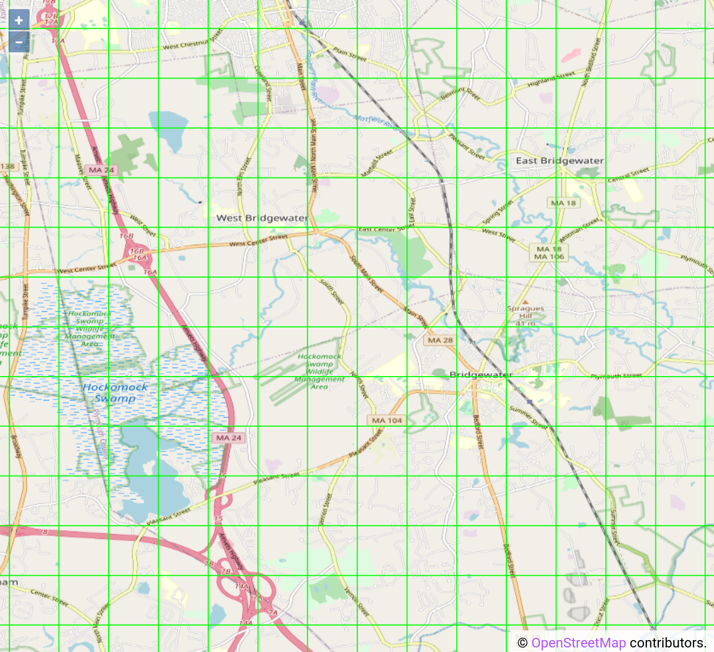
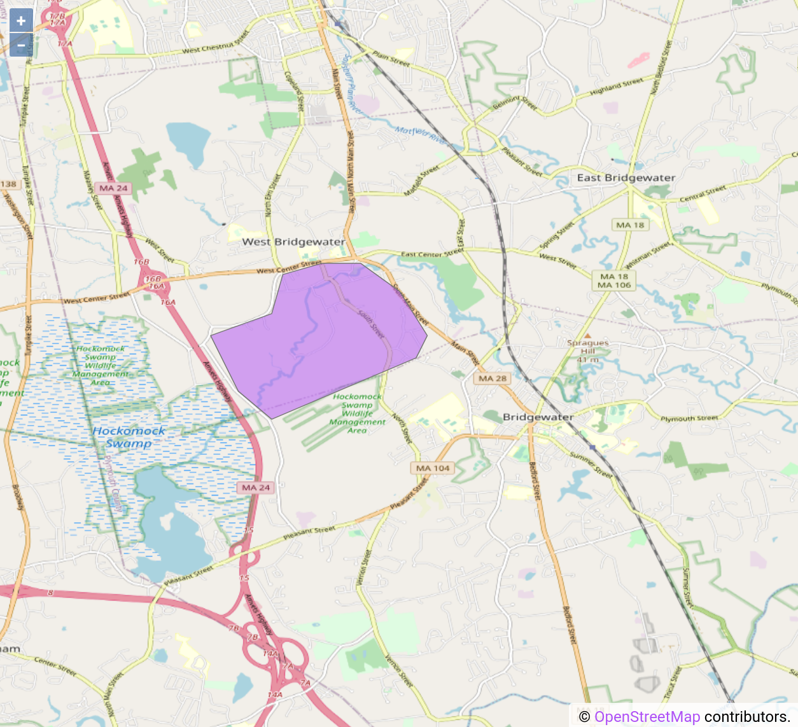
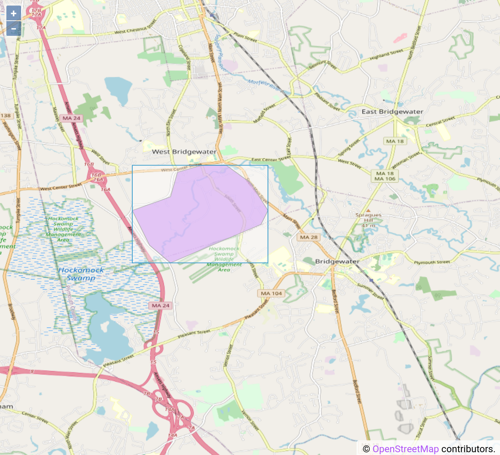
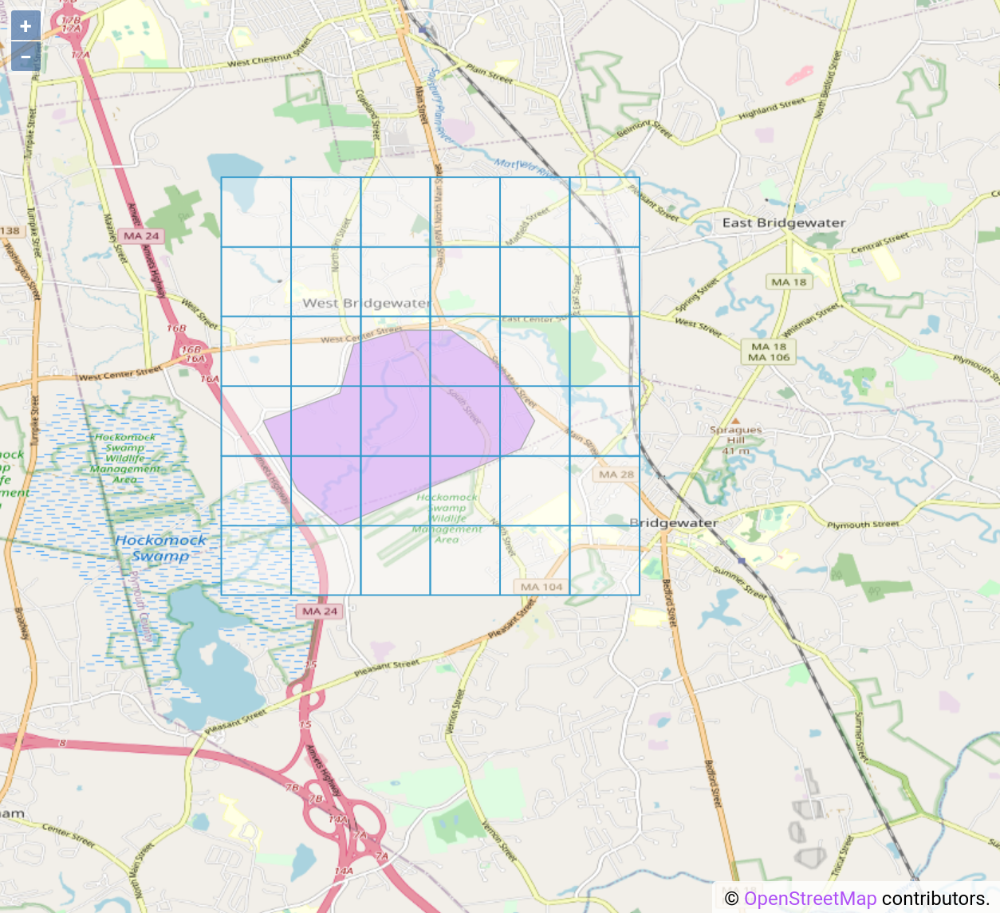
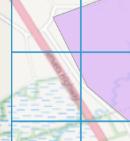
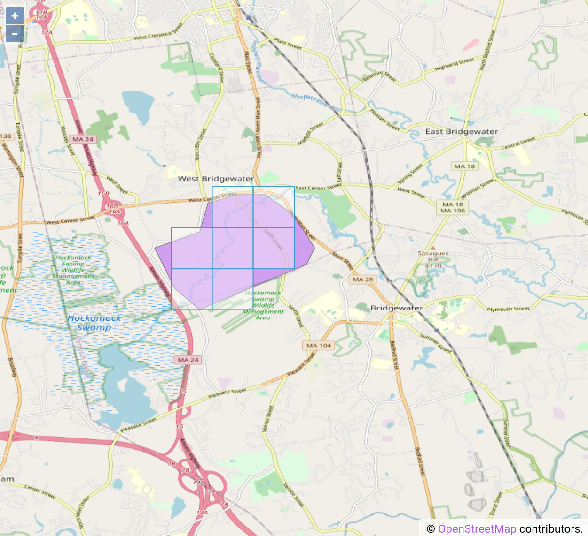

# Area Tiles
This document quickly explains some details about how area tiles work. This 
document uses pictures when possible to explain how these tiles work. It was
separated because it did not feel appropriate to turn in with milestone 1.

## Global Area Tiles
The entire globe is divided into 0.01 degree squares (Degrees as in latitude 
longitude with the `EPSG:4326` projection). 

  
*(Map showing 0.01 degree square tiles)*

These tiles are very easy to compute. For every valid latitude longitude pair 
there is a corresponding 0.01 degree squared tile which encompasses it. 
Furthermore this coordinate <-> tile relationship must be deterministic. The 
same tile must be returned every time we ask about the same coordinates. In our
implementation this is achieved by taking a coordinate pair and rounding it to 
the 2nd decimal. 

Global area tiles act exactly like a hash function, but in 2 dimensions!

## Exercise Area Tiles
The definition of our global area tiles makes it very easy to determine which
tiles are enclosed by an exercise.

The following steps will use example screenshots to determine the intersecting
global area tiles for this demo exercise area:

  
*(Map shows a demo exercise area)*

This is done in the following steps:

1. Draw a simple rectangle around the bounds of entire exercise track. This is 
   called the extent.

     
   *(Map with square around the demo exercise area, aka an extent)*
   
2. Find the global tiles which might be encompassed by the exercise 
   area's extent:
   
     
   *(Map showing the global tiles which might be involved with the demo 
   exercise area)*
   
   One may notice how there are a few extra tiles around the edges which don't
   seem like they belong. This is a side effect of our algorithm's rounding. 
   However it is necessary to ensure we don't miss any edge cases.
   
   Due to our method for determining which coordinate corresponds to which tile 
   being deterministic the tiles we found above line up with the global tiles we
   showed earlier.
   
3. Find which of the previous tiles intersect the exercise area. This is done by
   finding the center point of each tile, and seeing if this center point is in
   the exercise area. 
   
   This method avoids cases where an exercise track goes through the corner of
   a box. Like this box case from our demo exercise above:
   
     
   *(Map showing a case where an exercise track only passes through the corner
   of a global area box)*
   
   It would be unfair if a user got credit for exercising in this territory.
   
   Using the described method we find can find the global tiles which the demo
   exercise would claim:
   
   
   *(Map showing the tiles which the demo exercise would claim)*
   
   One may notice that a few parts of the demo exercise track did not claim any
   tiles. This is because they did not stray far enough into a global tile to 
   count as being claimed.
