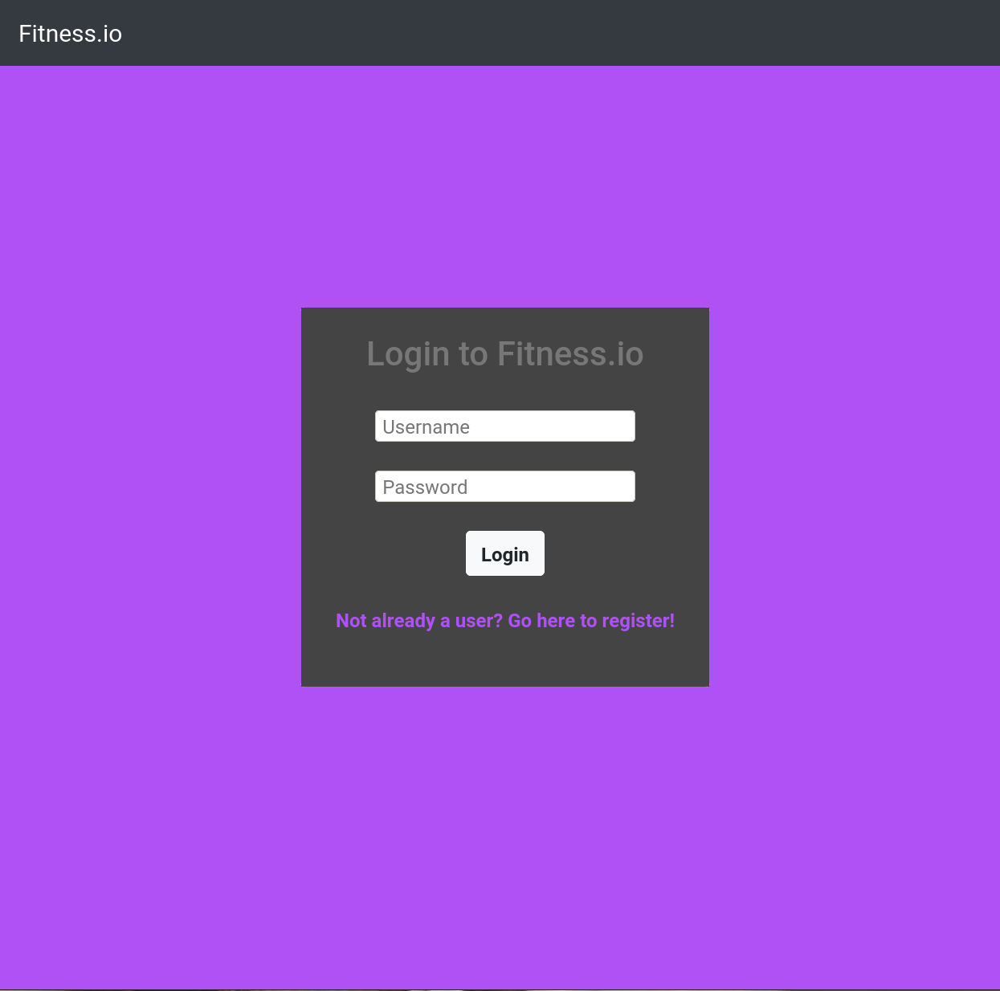
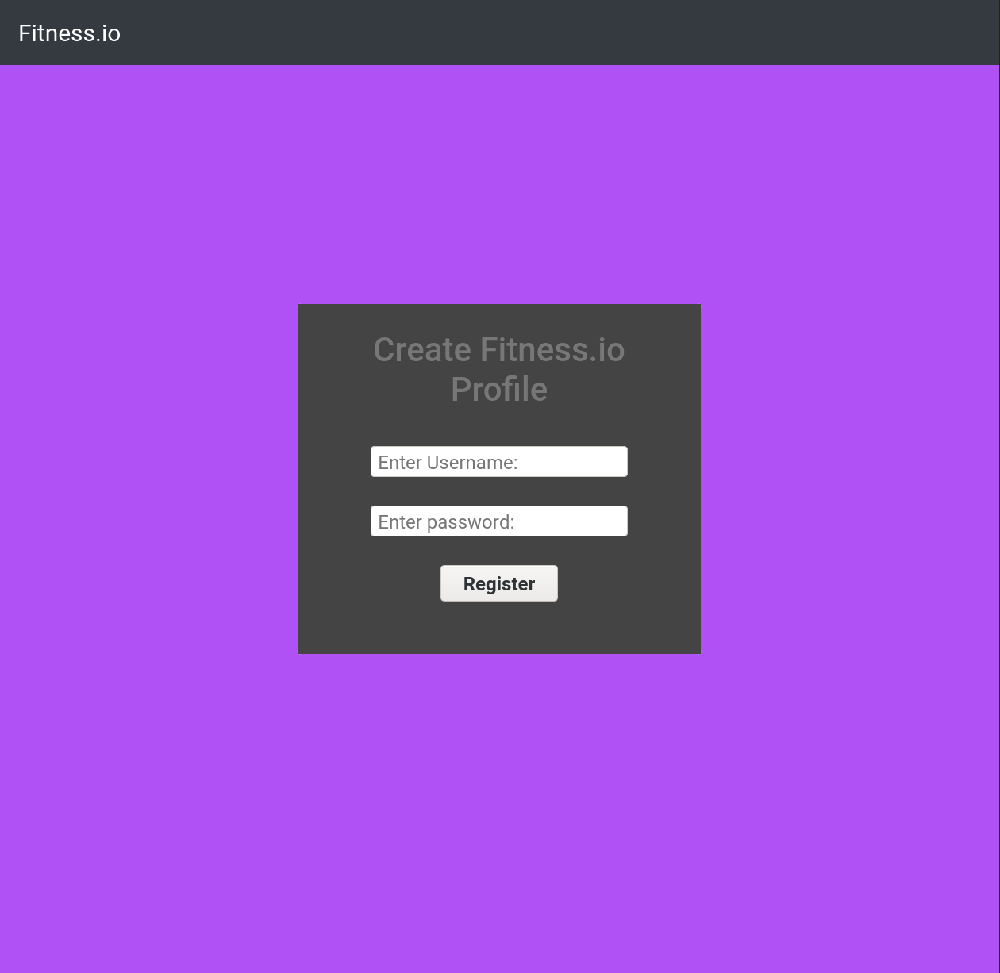
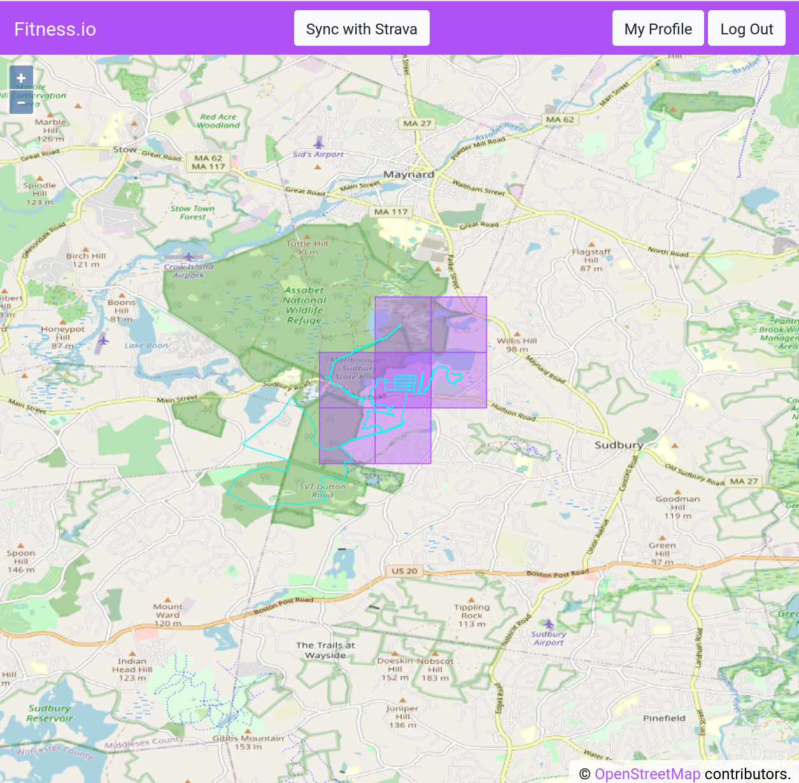
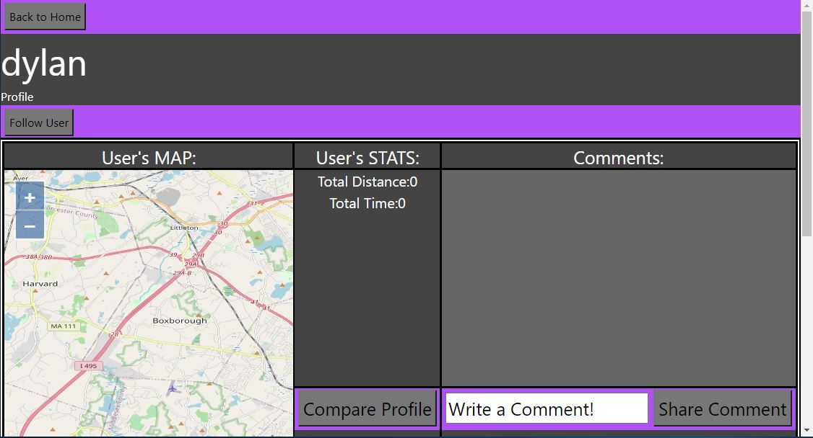
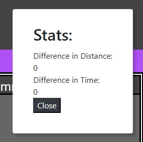

# Bet
## Fitness.io
## Fall 2020

### Overview
**A brief overview of your application. This will be based on what you are submitting as your final web application artifact. You should also mention why your application is innovative.**

### Team Members
**A list of your team members, with names and GitHub aliases.**

 - Patrick Goss - `pgoss`
 - Noah Huppert - `Noah-Huppert`
 - Dylan Toothaker - `DTooth`

### User Interface
**A final up-to-date list/table describing your application’s user interface. This should include the name of the UI view and its purpose. You should include a screenshot of each of your UI views.**

#### Login
The login page accepts a username and password. After the user hits the submit 
button it sends this data to the server for verification.

#### Register
The register page accepts a username and password for a new user. Once the user 
clicks submit a new user will be created by the server with the 
provided information.

#### Area

This page shows all areas and tracks claimed by users. The main element on this 
page is a map. The web page calls the get areas endpoint to retrieve the areas 
and tracks to display based on the coordinates currently being displayed.

Purple squares are claimed areas. Turquoise lines show excesses tracks.

#### Profile
- A specific user's profile page including their stats, their map of claimed area, and comments other users have posted.

- Profile page has a follow button, that adds this user as your friend. It has a 'back to home' button that returns the user to the home page (area.html). It also includes a post comment area, to leave a comment on a user's profile, and a compare stats button to see the difference in you and another users stats.
- Compare Stats Panel

### APIs: A final up-to-date list/table describing your application’s API

#### User
##### GET /user/${userId}/userStats
- GET method to retrieve another user's stats to compare to your own.
##### PUT /user/${userId}/addFriend
- PUT method to add or remove a friend from your friends list.
##### PUT /users/${userId}/comments
- PUT method to post a comment on a user's profile.

#### Area
##### GET /areas?extent=<extent>
- Get areas and tracks for a given portion of the map. 

### Database: A final up-to-date representation of your database including a brief description of each of the entities in your data model and their relationships if any.

#### UserDB: 
A database for the user's personal data such as username, password, friendslist, etc.

- `_id`: String,  Uniquely identifies a user
- `userName`: String,  Users selected username
- `salt`: String, Salt for user password
- `hash`: String, Hash for user password
- `userStats`: {  Object of the users stats
    -   `totalDistance`: Number,  The total distance the user has
    -   `totalTime`: Number  The total area the user has
- },
- `friendsList`: Number[],  Array of userId that represent which users this user has as a friend
- `comments`: Object[], Array of objects which include a userID, and a comment from that user.

#### TrackDB

- _id: String, Database identifier
- strava: Object
  - activityId: Number, ID of activity from Strava's API
- userId: ID of user who created the track
- points: Object[], Array of objects which represent the latitude and longitude
  line the track took.
- likes: String[], Array of user IDs who liked the track

### URL Routes/Mappings
**A final up-to-date table of all the URL routes that your application supports and a short description of what those routes are used for. You should also indicate any authentication and permissions on those routes.**

| URL | Endpoint |
| --- | -------- |
| GET `/` | Redirects to `area.html` if logged in, otherwise to `login.html` |
| GET `/strava_oauth_callback` | Strava OAuth Callback endpoint |
| GET `/strava_sync` | Strava sync endpoint |
| GET `/areas` | Get areas endpoint |
| GET `/my_profile` | Redirects to the currently logged in user's profile |
| PUT `/users/:userId/comments` | Comment on a user's profile endpoint |
| PUT `/users/:userId/addFriend` | Add friend endpoint |
| GET `/user/:userId/userStats` | Compare user stats endpoint |
| GET `/user` | Get user by id endpoint |
| POST `/login` | Login endpoint |
| POST `/register` | Create user endpoint |
| GET `/track/:trackId` | Get track by ID endpoint |

### Authentication/Authorization
A final up-to-date description of how users are authenticated and any permissions for specific users (if any) that you used in your application. You should mention how they relate to which UI views are accessible.

The express server which serves our HTML files makes sure that every request, 
except for requests to the login page and login endpoint, is authorized. If a 
request is not authorized the user is redirected to the login.html page.

User passwords are stored as hashes with their salt. When user's go to login 
the provided password is hashed and the hash is checked to see if it matches the
hash in the database.

### Division of Labor
**A breakdown of the division of labor for each team member — that is, saying who did what, for the entire project. Remember that everyone is expected to contribute roughly equally to each phase of the project. We expect to see similar numbers and kinds of GitHub commits by each student.**

#### Patrick
Worked on the login and register pages.

- login.html
- register.html
- login.scss
- register.scss
- login.js
- register.js

#### Dylan
- Profile.html
- Profile.js
- Profile.scss
- Ceated user endpoints: /addFriend /comment /user /userStats
- Implement dbUsers into endpoints
- Back-end profile functionality

#### Noah
I mainly worked on the Area and Track endpoints and screens.  

This involved developing the geometric algorithm to determine where workouts 
occurred, as well integrating with Strava and retrieving user data.

- area.html
- area.scss
- area.js
- Comment on user endpoint
- Get areas endpoint
- Strava web hook

### Conclusion
**A conclusion describing your team’s experience in working on this project. This should include what you learned through the design and implementation process, the difficulties you encountered, what your team would have liked to know before starting the project that would have helped you later, and any other technical hurdles that your team encountered**

Our team learned a lot creating this application. We learned very early on that our design process and implementation process would not be exactly what we wanted. When proposing our idea, Joseph let us know that the idea we had might be too out of scope for this class. We decided to go with it anyways because we wanted a challenge. We encountered a few difficulties implementing some of our ideas from our design process into the actual application. But with some minor changes we were able to get the majority of what we wanted to implement, implemented. Personally, I would have liked to spend a little more time on API endpoints and database implementation. Those were our two biggest struggles with this project. If we had more time we definitely would have liked to go through, fix bugs, make our HTML nicer looking, and implement a function to have strava automatically sync with our application and let users allow our app to use there location so a proper map loads when viewing their own profile. 
