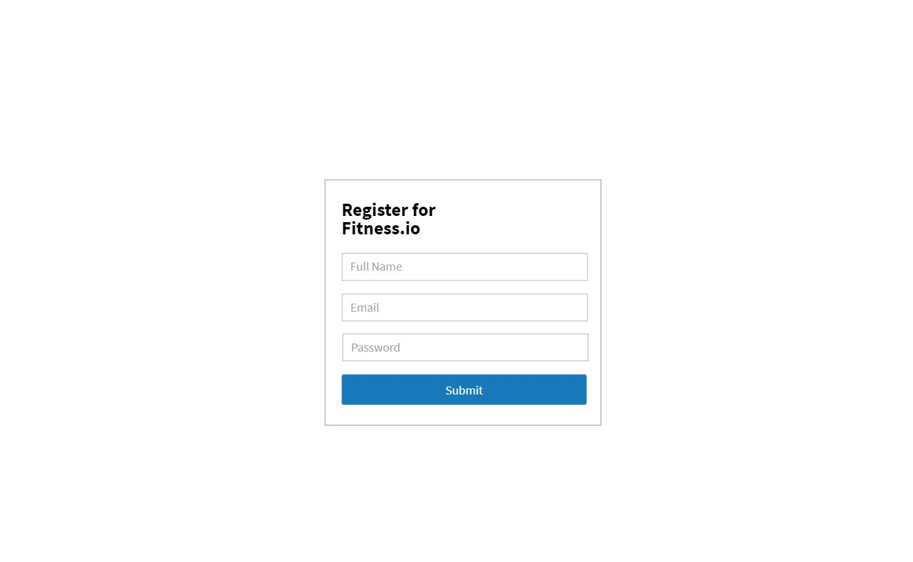
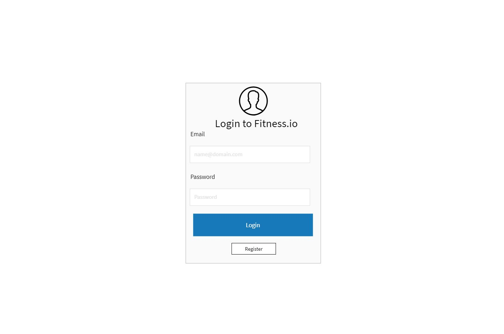
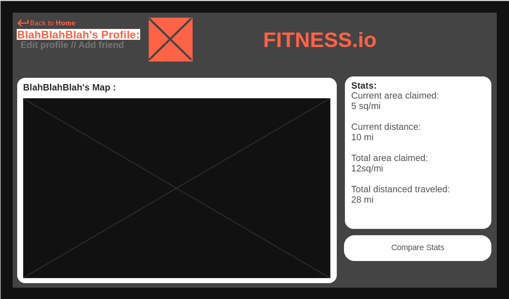

# Milestone 1
## Teamwork
### Division Of Labor
The division of labor in phase 1 is as follows:

- Data (Descriptions and user interactions)
  - **Name Of Data Type**: Your name
- Pages (Wireframes and HTML implementations)
  - **Create User**: Patrick Goss
  - **Login**: Patrick Goss
  - **Profile**: Dylan Toothaker
  - **Tracks**: Noah Huppert
  
Notes: The create user and login pages were both completed by Patrick Goss 
because these pages are similar. 

### Communication
The team held 2 virtual meetings over Zoom to directly coordinate work for this 
milestone. A private student only Slack channel was also used to communicate 
daily about milestone 1 details. The team made sure to come to an agreement 
before instituting any new processes or utilizing any new technologies.

## Data Interactions
This app will operate on a user based system. Each person that signs up will have their own profile that will keep track of their user data (email, password, username) and each user will have to sign up with an email and create a username and password for verification. Profiles will also keep track of the users personal fitness statistics (number of workouts, space claimed, duration of workouts, dates of workouts) so they can see how long and consistantly they workout. This app will also support data on what routes have been run in an area and will display this by showing the area claimed on a map. The ability to comment on different routes will also be available through this application. Finally this app will have data on which route is most popular, users will have the ability to rate different routes they have ran or biked.

## Data

User Data. Contains the data for each individual user.
User Data JSON: 
{
  userId : 1,
  userName : 'DToothaker',
  userPassword : 'password',
  userStats : {
      currentDistance : 12,
      totalDistance: 22,
      currentTime: 1456,
      totalTime: 2087
  },
  email : 'dtoothaker@umass.edu'
  friendsList : {
     friendID : [1, 5, 27]
  }
}

Each user will have a unique ID to identify them. Each user will have a username and passowrd to log into our application. Each user will have an email to register with.
We will also keep track of the users stats and friends list.

Track Data. Contains the data for each individual track
Track Data JSON:
{
  id : '123456789'
  long : 42.6359
  lat : -70.71
  comments : 'This is a comment that I commented'
  likes : 3
}

Each track will have a unique id to identify them. Each track will have a longitude and latitude value that will point to the beginning of each track. Each track will support comment data so users will be able to comment on each track and they will also support like data so users can like tracks.

Work Out Data JSON:
{
  startTime : 12:03
  finishTime : 13:03
  totalTime : 01:00
  date : 10-25-2020
}

Everytime a user completes a workout workout data will be logged. This includes a startTime value which will hold the time (military time) the workout was started, a finishTime value that will hold the time (military time) the workout was completed, and totalTime which will be the duration of the workout (startTime - finishTime). Each workout will also take down the date of the workout. All the times for now will be taken down in EST.

### Example Data Type
This data type is named example data type. It has the purpose of demonstrating 
how we will document our data in milestone 1.

The data type will have the following fields:

- `name` (String): The name of the thing
- `age` (Integer): The age of the thing
- `complex` (Object): A more complex field which has sub-fields
  - `foo` (String): A nested field under `complex` named `foo`
  - `bar` (Boolean): You get the idea

# Pages
## Register Page 

The purpose of the Register page is for users to create a profile by entering their email, a desired username and a password.
Wireframe:

[HTML implementation of wireframe](../../register.html)

## Login

The purpose of the Login page is to allow users to login with their personal login credentials, username and password.

[HTML implementation of wireframe](../../login.html)

## Profile 
Description:
This page shows a users profile which includes the users map, and stats 
as well as a way to compare the users stats to your own.
Wireframe:

HTML Implementation:
[HTML implementation of wireframe](../../profile.html)

## Area
The page shows areas claimed by exercises.

  

[HTML implementation of wireframe](../../area.html)

https://github.com/cs326-final-bet/cs326-final-bet/blob/main/docs/milestone-1/Profile%20page%20wirefram.PNG
