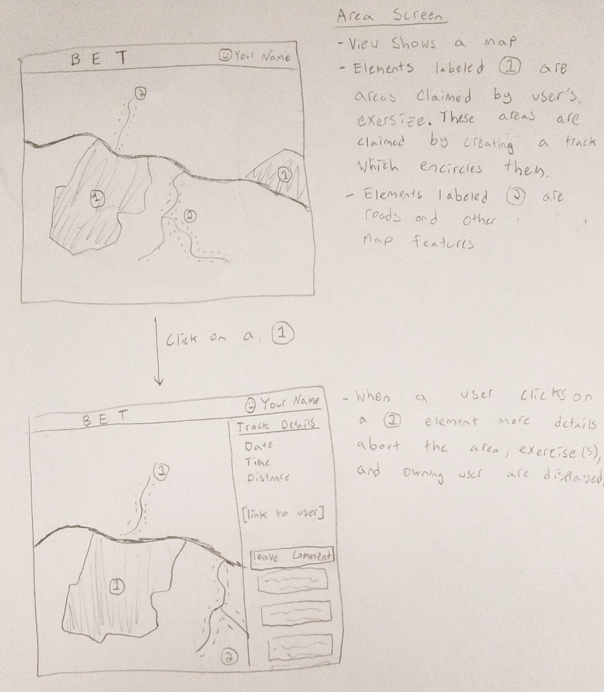

# Milestone 1
## Division Of Labor
The division of labor in phase 1 is as follows:

- Data (Descriptions and user interactions)
  - **Name Of Data Type**: Your name
- Pages (Wireframes and HTML implementations)
  - **Create User**: Patrick Goss
  - **Login**: Patrick Goss
  - **Profile**: Dylan Toothaker
  - **Tracks**: Noah Huppert
  
Notes: The create user and login pages were both completed by Patrick Goss 
because these pages are similar. 

## Data
TODO: List types of data  
TODO: Describe each type of data (Mock out a JSON object and describe each field)  
TODO: Describe user interactions with each piece of data  

### Example Data Type
This data type is named example data type. It has the purpose of demonstrating 
how we will document our data in milestone 1.

The data type will have the following fields:

- `name` (String): The name of the thing
- `age` (Integer): The age of the thing
- `complex` (Object): A more complex field which has sub-fields
  - `foo` (String): A nested field under `complex` named `foo`
  - `bar` (Boolean): You get the idea

# Pages
## Create User 
TODO: Quick description of purpose of page  
TODO: Upload wireframe picture  
TODO: Link to completed HTML page  

## Login
TODO: Quick description of purpose of page  
TODO: Upload wireframe picture  
TODO: Link to completed HTML page  

## Profile 
Description:
This page shows a users profile which includes the users map, and stats 
as well as a way to compare the users stats to your own.
Wireframe:
https://github.com/cs326-final-bet/cs326-final-bet/blob/main/docs/milestone-1/Profile%20page%20wirefram.PNG
HTML Implementation:
https://github.com/cs326-final-bet/cs326-final-bet/blob/main/profile.html

## Area
The page shows areas claimed by exercises.

  

[HTML implementation of wireframe](../../area.html)
